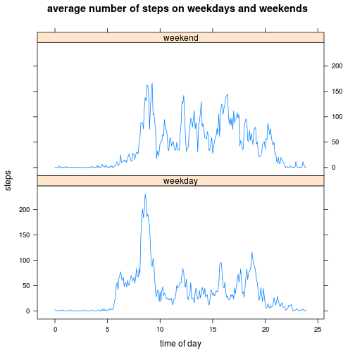

## Loading and preprocessing the data
It is assumed that the zip-file from the course web site is located in the current working directory of the script. The csv is extracted from the zip file and read into a data.frame in one line of code. The interval column of the resulting data.frame is transformed into a 4-letter character string with leading zeros.

```r
df<-read.csv(unz("activity.zip", "activity.csv"))
df$interval <- sprintf("%04d", df$interval)
```

## What is mean total number of steps taken per day?

```r
dates <- levels(df$date)
res <- numeric()
for (i in 1:length(dates)) {
  res[i] <- sum(df[df$date==dates[i],"steps"])
}
hist(res, main="Total number of steps per day", xlab="steps")
```

 

```r
mean(res, na.rm=TRUE)
```

```
## [1] 10766
```

```r
median(res, na.rm=TRUE)
```

```
## [1] 10765
```

The mean total number of steps taken per day is 1.0766 &times; 10<sup>4</sup>, the median total number of steps taken per day is 1.0765 &times; 10<sup>4</sup>

## What is the average daily activity pattern?

```r
timeofday <- levels(as.factor(df$interval))
meanSteps <- numeric()
for (i in 1:length(timeofday)) {
  meanSteps[i] <- mean(df[df$interval==timeofday[i],][,"steps"], na.rm=TRUE)
}
decimaltime <- as.numeric(substr(timeofday,1,2)) +
               as.numeric(substr(timeofday,3,4))*1/60
resdf <- data.frame(timeofday, decimaltime, meanSteps)
# find maximum
highmark<-with(resdf, resdf[meanSteps==max(meanSteps),])
highmark
```

```
##     timeofday decimaltime meanSteps
## 104      0835       8.583     206.2
```

```r
with(resdf, plot(meanSteps ~ decimaltime, type="l",
     main="average number of steps",
     ylab="steps",
     xlab="time of day"))
with(resdf, points(highmark[1,"meanSteps"] ~ highmark[1,"decimaltime"]))
with(resdf, text(highmark[1,"decimaltime"], highmark[1,"meanSteps"], 
     sprintf("@%s : %.2f", highmark[1,"timeofday"], highmark[1,"meanSteps"]), pos=4))
```

 

On average across all the days in the dataset, the 5-minute interval at 0835 contains the maximum numbers of steps: 206.1698.

## Imputing missing values
### Calculate and report the total number of missing values in the dataset (i.e. the total number of rows with NAs)

```r
# how many rows are in the data.frame?
nrow(df)
```

```
## [1] 17568
```

```r
# how many rows contain no measurement for the variable step?
nrow(df[is.na(df$steps),])
```

```
## [1] 2304
```

The raw dataset contains 17568 rows. Out of these, in 2304 rows a measurement of steps is missing (NA values).

### Devise a strategy for filling in all of the missing values in the dataset. 
If a row contain a missing (NA) value for `steps`, the mean of the corresponding 5-minute interval is filled into the steps column of the new dataframe `newdf`. The mean data from the earlier calculated `resdf` is used. 
### Create a new dataset that is equal to the original dataset but with the missing data filled in

```r
newdf <- df
for (i in 1:nrow(newdf)) {
  if (is.na(newdf[i, "steps"])) {
    newdf[i, "steps"] <- resdf[timeofday==newdf[i,"interval"], "meanSteps"]
  }
}
```

### Make a histogram of the total number of steps taken each day and Calculate and report the mean and median total number of steps taken per day.

```r
dates <- levels(newdf$date)
newres <- numeric()
for (i in 1:length(dates)) {
  newres[i] <- sum(newdf[newdf$date==dates[i],"steps"])
}
hist(newres, main="Total number of steps per day", xlab="steps")
```

 

```r
mean(newres, na.rm=TRUE)
```

```
## [1] 10766
```

```r
median(newres, na.rm=TRUE)
```

```
## [1] 10766
```

By using the strategy to fill missing values with the mean of the corresponding 5-minute interval, the estimated mean and median of the total daily number of steps is barely different from the outcome of the first research, where missing values were ignored.

## Are there differences in activity patterns between weekdays and weekends?

```r
library(lattice)
timeofday <- levels(as.factor(newdf$interval))
newdf$day <- factor(ifelse(as.POSIXlt(newdf$date)$wday %% 6 == 0, "weekend", "weekday"))
weekday <- levels(newdf$day)
resnewdf <- data.frame()
for (i in 1:length(weekday)) {
  meanSteps <- numeric()
  for (j in 1:length(timeofday)) {
    meanSteps[j] <- mean(
      newdf[newdf$interval==timeofday[j] & newdf$day==weekday[i],][,"steps"])
  }
  decimaltime <- as.numeric(substr(timeofday,1,2)) +
                 as.numeric(substr(timeofday,3,4))*1/60
  resnewdf <- rbind(resnewdf, data.frame(timeofday, decimaltime, meanSteps, day=weekday[i]))
}
xyplot(meanSteps ~ decimaltime | day, resnewdf, layout=c(1,2), type="l",
       main="average number of steps on weekdays and weekends",
       ylab="steps",
       xlab="time of day")
```

 

There are differences in activity patterns between weekdays and weekends. On weekends, the subject tends to sleep longer and stay awake until later in the evening. 
